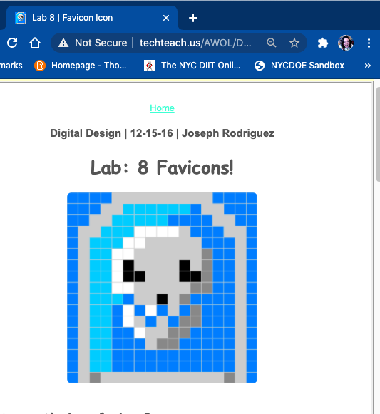
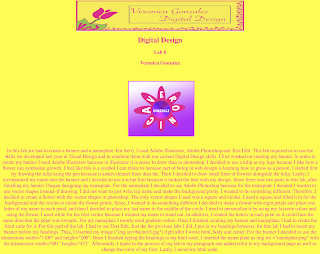
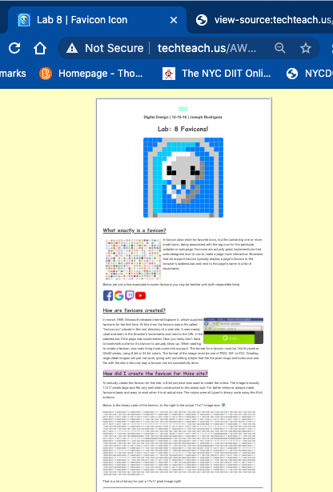

# Instructions  

  ** In this lab, we had to create a banner and a logo and a Favicon. For lab 6, we use Adobe Photoshop or Pixlr or photopea and repl.it. We first worked on creating the draft of banner and Logo. .Since there was 3 parts to this lab, tried to personalize it by using your favorite colors, fonts and . We create the html code for it. For this part of the lab, we use repl.it. Just like the previous labs we did, I put in my headings however, for this lab I had to insert my banner before my headings. Thus, I inserted my image ("img src=banner3.jpg") right after I wrote html, body and center. For the banner I decided to use the dimensions width="1100" and height="200". Once we finished typing the headings in my html code, we inserted the logo and draft in the body, and the banner as img src ="nameplate.png" with the dimensions  width="700 px" height="100px" in the head. Then we create a pixel version of our logo on code.org adn inserted on the head using <link rel="icon" type="image/png" href="filename.png"> 

We use https://studio.code.org/s/pixelation

**

  ## Requirements
  1. Create Favicon 
  2. Create Banner
  3. Create Webpage that incluses both banner and favicon (big and small versions)
  4. Explain on the page (should answer the following questions):   
    * What exactly is a favicon?
    * How are favicons created?
    * How did I create the favicon for this site?
    * What does your icon looks like, in binary and/or hexadecimal

  

  For example, here is the Replit logo:

  
  
  
  
  
  
  
  
  